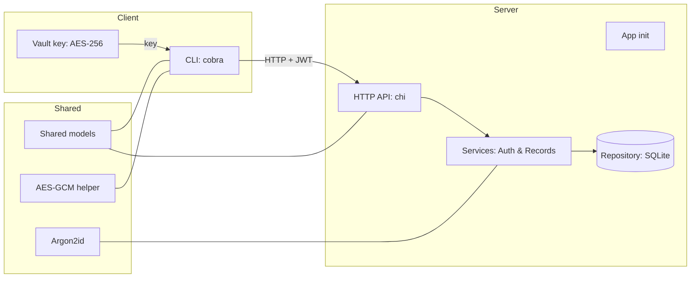

## GophKeeper — менеджер паролей (CLI + сервер)

Надёжная клиент‑серверная система для хранения логинов/паролей, текстов, бинарных данных и данных банковских карт. Клиент — кроссплатформенный CLI (Windows/Linux/macOS). Данные шифруются на клиенте и хранятся на сервере как непрозрачные payload.

### Коротко об уникальности
- Клиентское шифрование: сервер «не видит» содержимое, только метаданные и зашифрованный payload (AES‑GCM, ключ хранится локально).
- Синхронизация и конкуренция: версии записей с ETag/If‑Match и 412 при конфликте (оптимистическая блокировка).
- Безопасная аутентификация: Argon2id для паролей, JWT access + refresh‑токены (ротация).
- Чистая архитектура и кроссплатформенная сборка: чистый Go, SQLite через modernc (без CGO), понятные слои и покрытие тестами.

### Что решает и кому полезно
- Пользователю: единое место хранения паролей/секретов, доступное с нескольких устройств, с локальным шифрованием и удобной синхронизацией.
- Бизнесу: безопасная передача и хранение приватных данных, гибкая модель развертывания (on‑prem/облако), быстрое внедрение.

### Технологии курса и их применение
- Go 1.22, многослойная архитектура (`cmd`, `internal/server`, `internal/shared`, `internal/client`).
- HTTP сервер: `github.com/go-chi/chi/v5`.
- Аутентификация: `github.com/golang-jwt/jwt/v5` (JWT), `golang.org/x/crypto/argon2` (Argon2id).
- Хранилище: `modernc.org/sqlite` (SQLite, pure Go), JSON‑метаданные.
- CLI: `github.com/spf13/cobra`, `golang.org/x/term`.
- Крипто: AES‑GCM (локальные ключи), UUID, nonce‑prefix формат.
- Документация API: OpenAPI (`/swagger.yaml`).

### Архитектура


Слои:
- `cmd/server`, `cmd/gophkeeper` — точки входа.
- `internal/server/app` — запуск HTTP, graceful shutdown.
- `internal/server/httpapi` — маршрутизация, middleware, swagger, handlers.
- `internal/server/service` — бизнес‑логика: регистрация/логин/refresh, CRUD записей, оптимистичное версионирование.
- `internal/server/repository/sqlite` — доступ к БД (пользователи, записи, refresh‑токены).
- `internal/shared/*` — общие модели и крипто‑утилиты.
- `internal/client/cmd` — команды CLI (auth, records, vault).
- `internal/client/vault` — генерация и хранение локального ключа AES‑256.

## Быстрый старт (для презентации)

### Сборка
- Сервер (с версией и датой):
```powershell
# Windows PowerShell
go build -ldflags "-X main.version=0.1.0 -X main.buildDate=2025-08-13" -o bin/server.exe ./cmd/server
```
- Клиент:
```powershell
go build -ldflags "-X main.version=0.1.0 -X main.buildDate=2025-08-13" -o bin/gophkeeper.exe ./cmd/gophkeeper
```

### Запуск сервера
```powershell
$env:GOPHKEEPER_JWT_SECRET="your-strong-secret"
# опционально: $env:GOPHKEEPER_HTTP_ADDR=":8080"; $env:GOPHKEEPER_DB_DSN="file:gophkeeper.db?cache=shared&mode=rwc"
bin\server.exe
```

### Демонстрация CLI (скрипт для доклада)
```powershell
# 1) Версия и инициализация локального ключа
bin\gophkeeper.exe version
bin\gophkeeper.exe vault init
bin\gophkeeper.exe vault status

# 2) Регистрация и логин (интерактивно)
bin\gophkeeper.exe auth register
bin\gophkeeper.exe auth login

# 3) Добавление записей с клиентским шифрованием
bin\gophkeeper.exe records add-login   # Site/Login/Password
bin\gophkeeper.exe records add-text    # Title + ввод текста до EOF
bin\gophkeeper.exe records add-file README.md
bin\gophkeeper.exe records add-card    # Bank/Holder/Number/Exp/CVV

# 4) Получение и список
bin\gophkeeper.exe records list
bin\gophkeeper.exe records get <id>

# 5) Удаление
bin\gophkeeper.exe records delete <id>
```

### Демонстрация версионирования (ETag/If-Match)
```bash
# Linux/macOS curl пример
# Получить запись и текущую версию (ETag приходит в ответ при upsert, также версия есть в теле)
TOKEN="$(cat ~/.gophkeeper_token)"
ID="<id>"
curl -s -H "Authorization: Bearer $TOKEN" http://localhost:8080/api/v1/records/$ID | jq .version

# Обновить с If-Match (ожидаем текущую версию), сервер вернёт новый ETag и версию
curl -s -X POST \
  -H "Authorization: Bearer $TOKEN" \
  -H "Content-Type: application/json" \
  -H "If-Match: 3" \
  -d '{"id":"'$ID'","type":"text","meta":{"title":"demo"},"payload":""}' \
  http://localhost:8080/api/v1/records | jq .version

# При неправильной версии — 412 Precondition Failed
```

### Демонстрация refresh токена
```bash
REFRESH="$(cat ~/.gophkeeper_refresh)"
curl -s -X POST -H "Content-Type: application/json" \
  -d '{"refresh_token":"'$REFRESH'"}' \
  http://localhost:8080/api/v1/auth/refresh | jq
```

### Swagger/OpenAPI
```text
GET http://localhost:8080/swagger.yaml
```
Откройте спецификацию в любой OpenAPI‑viewer (Swagger UI/Insomnia/Postman) для интерактивного обзора API.

## Конфигурация
- `GOPHKEEPER_HTTP_ADDR` — адрес HTTP (по умолчанию `:8080`).
- `GOPHKEEPER_DB_DSN` — DSN для SQLite (по умолчанию `file:gophkeeper.db?cache=shared&mode=rwc`).
- `GOPHKEEPER_JWT_SECRET` — секрет подписи JWT (обязателен для продакшна).

CLI:
- Хранение токенов: `~/.gophkeeper_token`, `~/.gophkeeper_refresh`.
- Ключ шифрования: `~/.gophkeeper_vault_key` (AES‑256, base64).
- `GOPHKEEPER_SERVER_URL` — базовый URL сервера для фонового refresh (по умолчанию `http://localhost:8080`).

## API кратко
- `GET /health` — проверка здоровья.
- `POST /api/v1/auth/register` — регистрация `{email,password}`.
- `POST /api/v1/auth/login` — логин, возвращает `{access_token, refresh_token}`.
- `POST /api/v1/auth/refresh` — новый access по `refresh_token`.
- `GET /api/v1/records` — список записей (только мета и зашифрованный payload).
- `POST /api/v1/records` — создать/обновить запись. Поддерживает `If-Match: <version>` для оптимистического апдейта. Возвращает `ETag: <newVersion>`.
- `GET /api/v1/records/{id}` — получить запись.
- `DELETE /api/v1/records/{id}` — удалить запись.

Сервер хранит `payload` как BLOB и `meta` как JSON. Расшифровка выполняется только на клиенте.

## Безопасность
- Пароли пользователей — Argon2id (параметры для интерактивного логина).
- Клиентский AES‑GCM (256‑бит) с случайным nonce и AAD (тип + ключевые метаданные). Ключ хранится локально.
- JWT access (короткая жизнь) + refresh токены (ротация).
- Рекомендации для продакшна: TLS терминация, секреты и ключи в защищённом хранилище, audit‑логи, лимит запросов, CSP/корректные CORS при необходимости.

## Тестирование и качество
- Запуск тестов:
```bash
go test ./...
```
- Суммарное покрытие (включая все пакеты):
```bash
# профиль покрытия
go test -coverpkg=./... ./... -coverprofile=cover.out
# суммарный отчёт (Linux/macOS: просто команда ниже; Windows PowerShell: используйте cmd /c "...")
go tool cover -func=cover.out
# HTML-отчёт
go tool cover -html=cover.out
```
Актуально на сегодня:
- `internal/server/httpapi`: ~81%
- `internal/server/repository/sqlite`: ~81%
- `internal/shared/crypto`: ~82%
- `internal/shared/passhash`: ~85%
- `internal/server/service`: ~88%

Суммарно ядро системы покрыто не менее 80% юнит‑тестами (точки входа `cmd/*` не учитываются).

## План развития (Roadmap)
- TUI интерфейс (Bubble Tea) и экспорт/импорт.
- UI/Swagger UI встроенный.
- OTP (TOTP/HOTP) как тип записи, генерация на клиенте.
- Конфликты синхронизации: стратегии merge/resolve, история версий.
- Доп. слои безопасности: защита локального ключа паролем (Argon2id + KDF), интеграция с OS Keychain.
- Уведомления о синхронизации (SSE/WebSocket).
- Бинарный протокол для high‑perf синхронизации.

## Монетизация и применение
- SaaS подписка с multi‑device синхронизацией и расширенным хранением.
- Корпоративные on‑prem инсталляции (compliance, контроль ключей).
- White‑label для банков/финтеха/edtech.

## Ответы на вопросы для презентации
- В чём уникальность? — Клиентское шифрование + оптимистичное версионирование, чистая архитектура, кроссплатформенность без CGO.
- Какие технологии из курса? — Go, HTTP (chi), JWT, Argon2id, SQLite (modernc), многослойная архитектура, тесты, OpenAPI.
- Как проект будет эволюционировать? — Roadmap выше: TUI, OTP, конфликт‑резолвер, UI, бинарный протокол, усиление локальной безопасности.
- Где применить? — Личные/корпоративные хранилища секретов, форки для доменных нужд (банковские карты, OTP, файлы).
- Как обеспечить безопасность? — См. раздел «Безопасность»: KDF, client‑side crypto, ротация refresh, TLS, секреты окружения.

## Структура репозитория (основное)
- `cmd/server`, `cmd/gophkeeper` — бинарники.
- `internal/server/app` — запуск сервера.
- `internal/server/httpapi` — REST API, swagger.
- `internal/server/service` — бизнес‑логика.
- `internal/server/repository/sqlite` — БД (users, records, refresh_tokens).
- `internal/shared/models`, `internal/shared/crypto`, `internal/shared/passhash` — общие типы/крипто.
- `internal/client/cmd`, `internal/client/vault` — CLI и локальный ключ.
